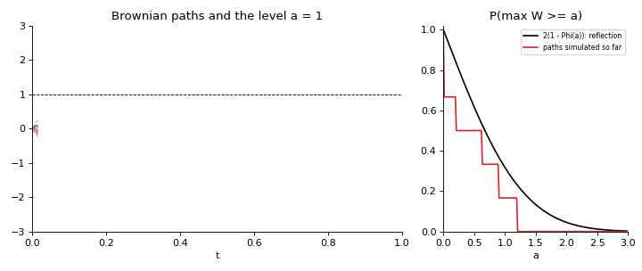
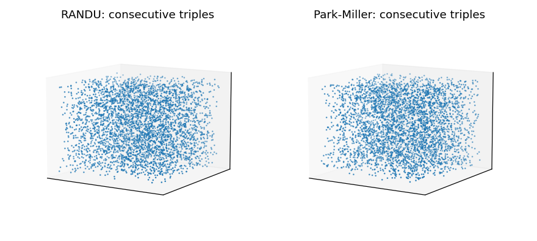
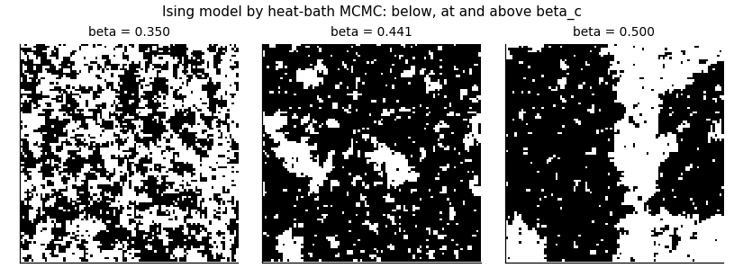
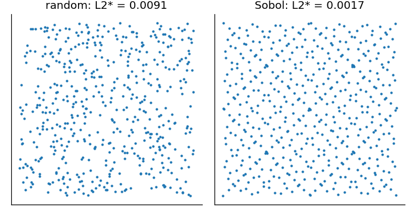
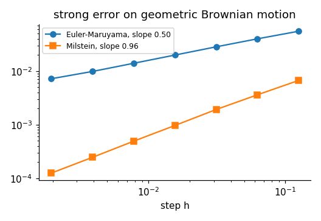
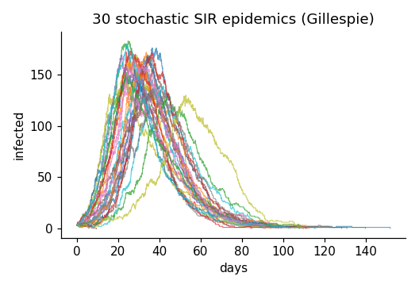
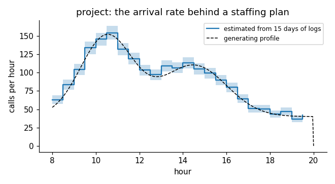

<div align="center">

# engstoch

**Stochastic processes and simulation from scratch: a validated NumPy toolkit, course data with documented faults, and a 20-notebook course with worked solutions.**

[](https://github.com/ktwyw/engstoch/actions/workflows/tests.yml)
[](docs/VALIDATION.md)
[](notebooks)
[](pyproject.toml)
[](LICENSE)
[](https://orcid.org/0000-0002-8488-9833)



</div>

`engstoch` implements stochastic processes and simulation in plain NumPy and teaches them through computation.
Pseudo-random generators (LCGs with RANDU's planes, xorshift64*, PCG32) and the statistical and spectral tests
that judge them; variates by inversion, rejection, Box-Muller, alias tables, Marsaglia-Tsang and copulas; Monte
Carlo with honest intervals, antithetic and control variates, importance and stratified sampling, common random
numbers; quasi-Monte Carlo with Halton, Sobol and lattice rules; discrete-time Markov chains (classes, periods,
stationary laws, absorption, first passages, mixing, estimation); random walks, the reflection principle, Pólya
recurrence and Galton-Watson branching; Poisson processes (thinning, time change, compound, spatial, inference)
and renewal theory (renewal equation, inspection paradox, age replacement); continuous-time chains with
uniformisation, birth-death processes and Gillespie's algorithm; queueing formulas from Erlang to
Pollaczek-Khinchine, staffing and Jackson networks; a discrete-event simulation engine; output analysis
(autocorrelation time, batch means, MSER, regeneration, R-hat); Brownian motion, barriers and first passages;
SDE solvers with strong and weak orders, Itô versus Stratonovich and multilevel Monte Carlo; Gaussian processes
by circulant embedding, fractional Brownian motion and ARMA time series; and MCMC from Metropolis to HMC and the
Ising model. The core depends on NumPy only; SciPy is used to check it.

```python
import numpy as np
from engstoch import queues, des, markov, sde, models

queues.mmc(lam=4.0, mu=1.0, c=6)["Wq"]                         # Erlang C: 0.1424
r = des.call_centre(lambda t: 4.0, 4.0, lambda g: g.exponential(1.0), 6, 20_000.0, np.random.default_rng(0))
np.nanmean(r["wait"])                                           # the event simulation agrees

models.snakes_and_ladders()["chain"].absorption()["expected_steps"][0]    # 20.37 throws, by one linear solve
markov.MarkovChain([[0.9, 0.1], [0.5, 0.5]]).mean_first_passage()         # Kac's 1/pi on the diagonal
sde.mlmc(lambda S: np.maximum(S - 100, 0), 100.0, 0.05, 0.2, 1.0, 0.02, np.random.default_rng(1))["estimate"]
```

## Why engstoch?

- **Every method validated, every claim checked.** 306 checks in [`docs/VALIDATION.md`](docs/VALIDATION.md),
  rerun in CI with warnings as errors: SciPy (special functions, Sobol and Halton points to the last bit,
  discrepancy, expm, Lyapunov, Welch and periodogram, KS and chi-square tests), published reference values
  (Park-Miller's x₁₀₀₀₀, PCG32's demo outputs, Knuth's spectral test, Onsager's exact Ising energy, Hull's
  Black-Scholes value), closed forms (Erlang B/C, Pollaczek-Khinchine, gambler's ruin, extinction probabilities,
  renewal functions, OU and CIR moments, Merton's barrier formula) and the theory itself (strong orders ½ and 1,
  weak order 1, interval coverage, Little's law, Pólya, the arcsine law, Held-Karp optimality for annealing).
- **Simulation treated as a statistical experiment.** Every simulated number in the course comes with an
  interval, autocorrelation is measured rather than ignored, warm-up is removed on evidence, comparisons use
  common random numbers, and decisions chosen by simulation are reassessed on fresh random numbers.
- **Data with faults, decisions with consequences.** Twenty days of call logs with an outage and dropped calls,
  ten years of rain records with seasons a Markov chain does not see, a machine log with a censored final
  sojourn, prices with a volatility regime change - and a project that turns the logs into a staffing plan and
  finds that both textbook staffing rules over-staff this line.
- **Failures taught, not avoided.** RANDU, the Wald interval at p = 0.001, antithetics that double the variance,
  a lattice generator that wrecks QMC, a homogeneous chain that invents second-order memory, Cholesky on a
  smooth kernel, Euler stepping CIR below zero, a Gibbs sampler on a ridge, Metropolis stuck in one mode.

## What's inside

| Module | Contents |
|---|---|
| `special` | normal cdf and quantile (AS 241), incomplete gamma and beta, chi-square, Student t, Poisson and Kolmogorov distributions |
| `rng` | LCG, RANDU, Park-Miller, xorshift64*, PCG32, Hull-Dobell; inversion, rejection, Box-Muller, polar, ratio of uniforms, alias tables, Poisson, binomial, geometric, Marsaglia-Tsang gamma, beta, multivariate normal, Gaussian copula, Fisher-Yates |
| `rngtests` | chi-square, Kolmogorov-Smirnov, serial, runs-up (Knuth), gap, autocorrelation, second-level tests, 2-D spectral test, RANDU's planes |
| `montecarlo` | means and intervals, Wilson intervals, sample size, two-stage procedure, integration, antithetic and control variates, importance sampling (plain, self-normalised, ESS), stratified sampling (proportional, Neyman), common random numbers |
| `qmc` | van der Corput, Halton (scrambled), Sobol (Joe-Kuo), Korobov lattices with a generator search, Warnock's L2-star discrepancy, randomised QMC, Genz test integrands |
| `markov` | classes (Tarjan), recurrence, periods, stationary laws, reversibility, mean first passage, Kemeny's constant, spectral gap, TV mixing, absorption, hitting probabilities and times, simulation, MLE, order test, PageRank, lumpability |
| `walks` | simple and lattice walks, gambler's ruin, reflection principle, ballot theorem, first returns, arcsine law, Pólya recurrence, Galton-Watson pgfs, extinction, generation moments, simulation |
| `poisson` | homogeneous, order-statistics, thinning, time change, compound, splitting, superposition, spatial (rectangle, disc), Garwood intervals, dispersion and uniformity tests, intensity estimation |
| `renewal` | simulation, renewal equation solver, closed forms and asymptotes, renewal-reward, age replacement, inspection paradox, equilibrium law, availability |
| `ctmc` | Padé expm, uniformisation with error bound, stationary law, jump chain, absorption times, simulation, generator MLE with censoring, birth-death chains, Gillespie SSA, tau-leaping |
| `queues` | M/M/1, Erlang B and C, M/M/c, M/M/c/K, M/M/∞, M/G/1, Kingman, Allen-Cunneen, Little, staffing and square-root staffing, Jackson networks, Lindley, G/G/c with abandonment |
| `des` | event-list simulator, time-weighted and tally statistics, call centre (time-varying arrivals, abandonment, staffing schedule), (s, S) inventory, machine repair |
| `output` | autocovariance by FFT, integrated autocorrelation time (Sokal, Geyer), ESS, batch means, replications, Welch's procedure, MSER-5, regenerative estimator, Gelman-Rubin R-hat, coverage |
| `brownian` | paths, Lévy refinement, bridge, Donsker, GBM, exact OU, reflection, first passage (inverse Gaussian), bridge-corrected crossings, quadratic variation, Karhunen-Loève, Black-Scholes, down-and-out call |
| `sde` | Euler-Maruyama (general noise), Milstein, stochastic Heun, Itô-Stratonovich conversion, strong and weak order studies, CIR full truncation, multilevel Monte Carlo |
| `gaussian` | exponential, squared exponential, Matérn, periodic, Brownian and fBM kernels; Cholesky sampling, circulant embedding, Davies-Harte fBM, Hurst estimation, GP conditioning, variograms |
| `timeseries` | ARMA simulation, causality and invertibility, ψ weights, theoretical ACF, sample ACF/PACF, Durbin-Levinson, Yule-Walker, AR least squares and AIC, Ljung-Box, periodogram, Welch, ARMA spectra |
| `mcmc` | adaptive random-walk Metropolis, independence sampler, Gibbs, HMC, leapfrog errors, Ising model (Metropolis and heat bath) with Onsager's exact results, simulated annealing |
| `models` | weather, Ehrenfest, (s, S) inventory chain, web graph, snakes and ladders, machine, M/M/c/K, SIR, Lotka-Volterra, gene expression, the call centre's arrival profile |
| `datasets` | call-centre logs, daily rain records, a machine event log, stock prices |

## Learn: the course

Twenty executed notebooks, each with learning objectives, an "Inside the algorithm" cell that rebuilds a
method by hand and checks it against the library, and exercises with an "Implement it yourself" task; every
exercise has a worked solution in [`solutions/`](solutions). They open in Google Colab.

| # | Notebook | What it establishes |
|---|---|---|
| 00 | [Randomness and pseudo-random generators](notebooks/00_randomness_and_generators.ipynb) | LCGs and full period, RANDU's planes, the spectral test, statistical tests, seeding and streams |
| 01 | [Generating random variates](notebooks/01_generating_random_variates.ipynb) | inversion, rejection, normal generators, alias tables, gamma, copulas |
| 02 | [Monte Carlo estimation and its error](notebooks/02_monte_carlo_estimation.ipynb) | standard errors, coverage, sample size, rare events, high-dimensional integration |
| 03 | [Variance reduction](notebooks/03_variance_reduction.ipynb) | antithetics, control variates, importance and stratified sampling, common random numbers |
| 04 | [Quasi-Monte Carlo](notebooks/04_quasi_monte_carlo.ipynb) | Halton, Sobol, lattices, discrepancy, n⁻¹ convergence, randomised QMC |
| 05 | [Discrete-time Markov chains](notebooks/05_discrete_time_markov_chains.ipynb) | n-step behaviour, classes and periods, simulation, estimation from rain data |
| 06 | [Long-run behaviour and mixing](notebooks/06_long_run_behaviour_and_mixing.ipynb) | stationary laws, first passages, mixing and cutoff, reversibility, PageRank |
| 07 | [Absorption, hitting times and random walks](notebooks/07_absorption_hitting_and_random_walks.ipynb) | gambler's ruin, snakes and ladders, reflection, arcsine law, Pólya |
| 08 | [Branching processes](notebooks/08_branching_processes.ipynb) | generation sizes, extinction as a fixed point, criticality, offspring variability |
| 09 | [The Poisson process](notebooks/09_the_poisson_process.ipynb) | constructions, thinning, call-centre logs, compound, split and spatial processes |
| 10 | [Renewal processes](notebooks/10_renewal_processes.ipynb) | renewal function, inspection paradox, age replacement, availability |
| 11 | [Continuous-time Markov chains](notebooks/11_continuous_time_markov_chains.ipynb) | exp(Qt), uniformisation, a machine log, birth-death chains, Gillespie |
| 12 | [Queueing theory](notebooks/12_queueing_theory.ipynb) | M/M/1 to M/G/1, Erlang B and C, staffing, Little's law, real handle times |
| 13 | [Discrete-event simulation](notebooks/13_discrete_event_simulation.ipynb) | the engine, abandonment, machine repair, optimising an inventory policy |
| 14 | [Output analysis](notebooks/14_output_analysis.ipynb) | autocorrelation time, batch means, warm-up, regeneration, replications |
| 15 | [Brownian motion](notebooks/15_brownian_motion.ipynb) | constructions, quadratic variation, reflection, first passage, GBM on prices |
| 16 | [Stochastic differential equations](notebooks/16_stochastic_differential_equations.ipynb) | Euler-Maruyama, Milstein, strong and weak order, Itô vs Stratonovich, MLMC |
| 17 | [Gaussian processes and time series](notebooks/17_gaussian_processes_and_time_series.ipynb) | kernels, circulant embedding, fBM, GP regression, ARMA identification |
| 18 | [Markov chain Monte Carlo](notebooks/18_markov_chain_monte_carlo.ipynb) | Metropolis tuning, a posterior, Gibbs, HMC, the Ising transition |
| 19 | [Project: staffing a call centre from data](notebooks/19_project_staffing_a_call_centre.ipynb) | rates from logs, Erlang C slot by slot, lag-aware staffing, simulation, report |

The theory behind each method, with references, is in [`docs/THEORY.md`](docs/THEORY.md).

## Gallery

Every image is computed by the library; `python tools/make_images.py` regenerates them.

| | |
|:-:|:-:|
| <br>RANDU's triples on 15 planes, Park-Miller's filling the cube | <br>The Ising model below, at and above the critical temperature |
| <br>Random points against Sobol points: discrepancy ten times smaller | <br>Strong orders ½ (Euler) and 1 (Milstein) on one Brownian path |
| <br>Thirty stochastic epidemics: minor outbreaks and major ones | <br>The project: the arrival rate behind a staffing plan |

## Install

```bash
pip install "engstoch @ git+https://github.com/ktwyw/engstoch"
# with the notebook dependencies (SciPy, Matplotlib, pandas, JupyterLab):
pip install "engstoch[notebooks] @ git+https://github.com/ktwyw/engstoch"
# or, for development:
git clone https://github.com/ktwyw/engstoch && cd engstoch && pip install -e ".[dev]"
```

## Validation at a glance

| Reference | What is checked | Agreement |
|---|---|---|
| SciPy | normal, gamma, beta, chi-square, t and Kolmogorov functions; Sobol and Halton points; L2-star discrepancy; expm; Lyapunov; Toeplitz solves; periodogram and Welch; KS and chi-square statistics; GP log-likelihood | exact to 10⁻¹⁰ |
| Published values | Park-Miller x₁₀₀₀₀ = 1043618065, PCG32's demo stream, ν₂² = 282475250 for the minimal standard, Onsager's energy and the Onsager-Yang magnetisation, Black-Scholes 10.4506, Pólya's 0.3405 | exact or within sampling error |
| Closed forms | Erlang B/C, M/M/c/K, Pollaczek-Khinchine, Erlang-A, Jackson; gambler's ruin and its duration variance; extinction probabilities; renewal functions; inspection paradox; Garwood intervals; OU, CIR and GBM moments; Merton's barrier; first-passage laws | 10⁻¹² (formulas) to a few standard errors (simulations) |
| Theory | strong orders ½ and 1, weak order 1, leapfrog order 2, interval coverage, Little's law, Kac's lemma, Kemeny's constant, ballot and arcsine laws, insensitivity, optimal Metropolis scaling 0.234, Held-Karp optimality | as stated |
| Data | the course files reproduce their generating models and show the documented faults (outage, dropped calls, seasonality, censoring, volatility regime) | as stated |

## Citing

If `engstoch` helps your work, please cite it using [`CITATION.cff`](CITATION.cff).

## Author

**Yanwei Wang** - personal open-source project.
[GitHub @ktwyw](https://github.com/ktwyw) · [ORCID 0000-0002-8488-9833](https://orcid.org/0000-0002-8488-9833) ·
wangyanwei@gmail.com

Also by the author: [englincontrol](https://github.com/ktwyw/englincontrol), [engnumeric](https://github.com/ktwyw/engnumeric),
[engmolines](https://github.com/ktwyw/engmolines), [engmath](https://github.com/ktwyw/engmath), [engstat](https://github.com/ktwyw/engstat),
[fluidmech](https://github.com/ktwyw/fluidmech), [engrheo](https://github.com/ktwyw/engrheo), [engthermo](https://github.com/ktwyw/engthermo),
[engcolloid](https://github.com/ktwyw/engcolloid), [engdiscrete](https://github.com/ktwyw/engdiscrete), [engreact](https://github.com/ktwyw/engreact),
[engsep](https://github.com/ktwyw/engsep) and [engbalance](https://github.com/ktwyw/engbalance).

## License

MIT - see [LICENSE](LICENSE). Contributions welcome: see [CONTRIBUTING.md](CONTRIBUTING.md).
